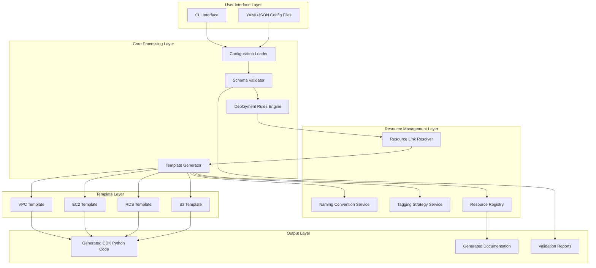

# Design Document: CDK AWS Templates System

## Overview

El CDK AWS Templates System es un framework en Python que proporciona un enfoque declarativo y estandarizado para desplegar infraestructura AWS usando AWS CDK. El sistema traduce configuraciones YAML/JSON en código CDK Python, aplicando automáticamente convenciones de nombres, estrategias de etiquetado, y reglas de despliegue que aseguran homogeneidad y cumplimiento de políticas corporativas.

### Core Design Principles

1. **Declarative Configuration**: Los usuarios definen "qué" desplegar, no "cómo" desplegarlo
2. **Convention over Configuration**: Valores por defecto sensatos que siguen mejores prácticas AWS
3. **Validation First**: Validación exhaustiva antes de generar código CDK o desplegar recursos
4. **Composability**: Recursos se enlazan declarativamente, el sistema resuelve dependencias
5. **Environment Awareness**: Configuraciones específicas por entorno con herencia y sobrescritura

### System Boundaries

**In Scope:**
- Generación de código CDK Python desde configuraciones declarativas
- Validación de configuraciones contra esquemas y reglas de negocio
- Gestión de convenciones de nombres y etiquetado
- Sistema de enlaces entre recursos y resolución de dependencias
- Plantillas para VPC, EC2, RDS, S3 con configuraciones estandarizadas
- Registro y descubrimiento de recursos desplegados
- Generación de documentación de infraestructura

**Out of Scope:**
- Ejecución directa de despliegues CDK (el sistema genera código, el usuario ejecuta `cdk deploy`)
- Monitoreo en tiempo real de recursos AWS
- Gestión de secretos (delegado a AWS Secrets Manager)
- Gestión de costos y billing (solo etiquetado para facilitar tracking)

## Architecture

### High-Level Architecture




### Architecture Layers

**1. User Interface Layer**
- CLI para interacción con el sistema
- Carga de archivos de configuración YAML/JSON
- Comandos para validación, generación, y consulta de recursos

**2. Core Processing Layer**
- Configuration Loader: parsea y combina múltiples archivos de configuración
- Schema Validator: valida configuraciones contra esquemas JSON Schema
- Rules Engine: aplica reglas de despliegue y políticas corporativas
- Template Generator: orquesta la generación de código CDK

**3. Resource Management Layer**
- Naming Convention Service: genera nombres consistentes para recursos
- Tagging Strategy Service: aplica etiquetas obligatorias y opcionales
- Resource Link Resolver: resuelve referencias entre recursos y detecta ciclos
- Resource Registry: mantiene inventario de recursos desplegados

**4. Template Layer**
- Plantillas especializadas para cada tipo de recurso AWS
- Cada plantilla encapsula mejores prácticas y configuraciones por defecto
- Plantillas generan constructos CDK Python

**5. Output Layer**
- Código CDK Python sintácticamente correcto y ejecutable
- Documentación en Markdown/HTML/PDF
- Reportes de validación con errores detallados

### Data Flow

1. Usuario proporciona archivos de configuración YAML/JSON
2. Configuration Loader parsea y combina configuraciones
3. Schema Validator valida estructura y tipos de datos
4. Rules Engine aplica políticas y puede modificar/rechazar configuraciones
5. Link Resolver construye grafo de dependencias y detecta ciclos
6. Template Generator invoca plantillas específicas por tipo de recurso
7. Cada plantilla consulta Naming Service y Tagging Service
8. Código CDK generado se escribe a archivos Python
9. Resource Registry se actualiza con metadatos de recursos
10. Documentation Generator crea diagramas y documentación

## Components and Interfaces

### 1. Configuration Loader

**Responsibility:** Cargar, parsear y combinar archivos de configuración.

**Interface:**
```python
class ConfigurationLoader:
    def load_config(self, file_paths: List[str]) -> Configuration:
        """Carga y combina múltiples archivos de configuración"""
        
    def resolve_variables(self, config: Configuration, env_vars: Dict[str, str]) -> Configuration:
        """Resuelve variables de entorno y parámetros"""
        
    def merge_configs(self, configs: List[Configuration]) -> Configuration:
        """Combina múltiples configuraciones con estrategia de sobrescritura"""
```

**Key Behaviors:**
- Soporta YAML y JSON
- Permite referencias a variables de entorno: `${ENV_VAR}`
- Combina múltiples archivos con estrategia de merge profundo
- Valida sintaxis básica durante carga

### 2. Schema Validator

**Responsibility:** Validar configuraciones contra esquemas JSON Schema.

**Interface:**
```python
class SchemaValidator:
    def validate(self, config: Configuration) -> ValidationResult:
        """Valida configuración completa contra todos los esquemas"""
        
    def validate_resource(self, resource_type: str, resource_config: Dict) -> ValidationResult:
        """Valida un recurso individual contra su esquema"""
        
    def get_schema(self, resource_type: str) -> JSONSchema:
        """Retorna el esquema para un tipo de recurso"""
```

**Key Behaviors:**
- Esquemas JSON Schema para cada tipo de recurso
- Validación de tipos de datos, campos obligatorios, y constraints
- Mensajes de error descriptivos con path al campo inválido
- Validación de límites de servicio AWS (ej: longitud de nombres)

### 3. Deployment Rules Engine

**Responsibility:** Aplicar reglas de negocio y políticas corporativas.

**Interface:**
```python
class DeploymentRulesEngine:
    def register_rule(self, rule: DeploymentRule, priority: int):
        """Registra una regla con prioridad específica"""
        
    def apply_rules(self, config: Configuration) -> RuleApplicationResult:
        """Aplica todas las reglas registradas en orden de prioridad"""
        
class DeploymentRule(ABC):
    @abstractmethod
    def apply(self, config: Configuration) -> RuleResult:
        """Aplica la regla, puede modificar config o rechazarla"""
```

**Key Behaviors:**
- Reglas se ejecutan en orden de prioridad
- Reglas pueden modificar configuración (ej: forzar encriptación)
- Reglas pueden rechazar configuración (ej: violación de política)
- Todas las modificaciones se registran en audit log

**Example Rules:**
- `EncryptionEnforcementRule`: fuerza encriptación en RDS y S3
- `ProductionProtectionRule`: previene cambios destructivos en producción
- `TagComplianceRule`: asegura presencia de etiquetas obligatorias
- `NamingConventionRule`: valida nombres contra convención

### 4. Resource Link Resolver

**Responsibility:** Resolver referencias entre recursos y detectar dependencias circulares.

**Interface:**
```python
class ResourceLinkResolver:
    def resolve_links(self, config: Configuration) -> LinkResolutionResult:
        """Resuelve todos los enlaces entre recursos"""
        
    def build_dependency_graph(self, config: Configuration) -> DependencyGraph:
        """Construye grafo de dependencias entre recursos"""
        
    def detect_cycles(self, graph: DependencyGraph) -> List[Cycle]:
        """Detecta ciclos en el grafo de dependencias"""
        
    def topological_sort(self, graph: DependencyGraph) -> List[ResourceId]:
        """Retorna orden de despliegue respetando dependencias"""
```

**Key Behaviors:**
- Referencias usan identificadores lógicos: `${resource.vpc-main.id}`
- Construye grafo dirigido de dependencias
- Detecta ciclos usando DFS
- Ordena recursos topológicamente para despliegue secuencial
- Valida que recursos referenciados existan

### 5. Naming Convention Service

**Responsibility:** Generar nombres consistentes para recursos AWS.

**Interface:**
```python
class NamingConventionService:
    def generate_name(self, 
                     resource_type: str,
                     purpose: str,
                     environment: str,
                     region: str,
                     instance_number: Optional[int] = None) -> str:
        """Genera nombre siguiendo convención establecida"""
        
    def validate_name(self, name: str, resource_type: str) -> ValidationResult:
        """Valida que un nombre cumpla con restricciones AWS"""
```

**Naming Pattern:**
```
{environment}-{service}-{purpose}-{region}[-{instance}]

Examples:
- prod-myapp-vpc-us-east-1
- dev-myapp-ec2-web-us-east-1-01
- staging-myapp-rds-main-eu-west-1
```

**Key Behaviors:**
- Valida longitud máxima según tipo de recurso
- Valida caracteres permitidos según tipo de recurso
- Genera sufijos numéricos para múltiples instancias
- Convierte a lowercase para consistencia

### 6. Tagging Strategy Service

**Responsibility:** Aplicar etiquetas consistentes a todos los recursos.

**Interface:**
```python
class TaggingStrategyService:
    def get_mandatory_tags(self, environment: str) -> Dict[str, str]:
        """Retorna etiquetas obligatorias para un entorno"""
        
    def apply_tags(self, resource: Resource, custom_tags: Dict[str, str]) -> Dict[str, str]:
        """Combina etiquetas obligatorias con custom tags"""
        
    def inherit_tags(self, parent: Resource, child: Resource) -> Dict[str, str]:
        """Hereda etiquetas de recurso padre a hijo"""
```

**Mandatory Tags:**
- `Environment`: dev, staging, prod
- `Project`: nombre del proyecto
- `Owner`: equipo o persona responsable
- `CostCenter`: centro de costos para billing
- `ManagedBy`: "cdk-template-system"

**Key Behaviors:**
- Etiquetas obligatorias se aplican automáticamente
- Custom tags pueden agregarse pero no sobrescribir obligatorias
- Herencia de tags de padre a hijo (ej: VPC → Subnets)
- Validación de formato de valores de tags

### 7. Resource Registry

**Responsibility:** Mantener inventario de recursos desplegados.

**Interface:**
```python
class ResourceRegistry:
    def register_resource(self, resource: ResourceMetadata):
        """Registra un recurso desplegado"""
        
    def unregister_resource(self, resource_id: str):
        """Elimina un recurso del registro"""
        
    def query_resources(self, filters: ResourceQuery) -> List[ResourceMetadata]:
        """Consulta recursos por tipo, tag, nombre, etc."""
        
    def get_resource(self, resource_id: str) -> Optional[ResourceMetadata]:
        """Obtiene metadatos de un recurso específico"""
        
    def export_inventory(self, format: str) -> str:
        """Exporta inventario completo en formato especificado"""
```

**Storage:**
- Backend: archivo JSON local o DynamoDB para multi-usuario
- Estructura: índices por tipo, environment, stack, tags

**ResourceMetadata:**
```python
@dataclass
class ResourceMetadata:
    resource_id: str
    resource_type: str
    logical_name: str
    physical_name: str
    stack_name: str
    environment: str
    tags: Dict[str, str]
    outputs: Dict[str, str]
    dependencies: List[str]
    created_at: datetime
    updated_at: datetime
```

### 8. Template Generator

**Responsibility:** Orquestar generación de código CDK Python.

**Interface:**
```python
class TemplateGenerator:
    def generate(self, config: Configuration) -> GenerationResult:
        """Genera código CDK completo desde configuración"""
        
    def generate_stack(self, stack_config: StackConfiguration) -> str:
        """Genera código para un stack individual"""
        
    def generate_imports(self, resources: List[Resource]) -> str:
        """Genera imports necesarios para los recursos"""
```

**Key Behaviors:**
- Invoca plantillas específicas por tipo de recurso
- Genera estructura de archivos: app.py, stacks/, resources/
- Incluye comentarios explicativos en código generado
- Aplica formateo con black para código Python consistente

### 9. Resource Templates

Cada plantilla implementa la interfaz:

```python
class ResourceTemplate(ABC):
    @abstractmethod
    def generate_code(self, resource_config: Dict, context: GenerationContext) -> str:
        """Genera código CDK para este tipo de recurso"""
        
    @abstractmethod
    def get_outputs(self, resource_config: Dict) -> Dict[str, str]:
        """Define outputs que este recurso exporta"""
```

#### VPC Template

**Generated Resources:**
- VPC con CIDR block configurable
- Subnets públicas y privadas en múltiples AZs
- Internet Gateway para subnets públicas
- NAT Gateways para subnets privadas (uno por AZ para HA)
- Route Tables y asociaciones
- Network ACLs
- VPC Flow Logs a CloudWatch Logs

**Configuration Schema:**
```yaml
vpc:
  logical_id: vpc-main
  cidr: "10.0.0.0/16"
  availability_zones: 3
  enable_dns_hostnames: true
  enable_dns_support: true
  enable_flow_logs: true
  nat_gateways: 3  # one per AZ for HA
```

#### EC2 Template

**Generated Resources:**
- EC2 Instance con tipo configurable
- IAM Role con AmazonSSMManagedInstanceCore policy
- Instance Profile
- Security Group
- EBS Volumes con encriptación
- User Data script para inicialización
- SSM Agent configuration

**Configuration Schema:**
```yaml
ec2:
  logical_id: ec2-web-01
  instance_type: t3.medium
  ami_id: ${ssm:/aws/service/ami-amazon-linux-latest/amzn2-ami-hvm-x86_64-gp2}
  vpc_ref: ${resource.vpc-main.id}
  subnet_ref: ${resource.vpc-main.private_subnet_1}
  enable_session_manager: true
  enable_detailed_monitoring: false
  root_volume:
    size: 30
    encrypted: true
    volume_type: gp3
  user_data_script: |
    #!/bin/bash
    yum update -y
    yum install -y amazon-ssm-agent
    systemctl enable amazon-ssm-agent
    systemctl start amazon-ssm-agent
```

#### RDS Template

**Generated Resources:**
- RDS Instance o Cluster
- DB Subnet Group
- Security Group
- KMS Key para encriptación
- Secret en Secrets Manager para credenciales
- CloudWatch Alarms para monitoreo

**Configuration Schema:**
```yaml
rds:
  logical_id: rds-main
  engine: postgres
  engine_version: "15.3"
  instance_class: db.t3.medium
  allocated_storage: 100
  multi_az: true
  vpc_ref: ${resource.vpc-main.id}
  subnet_refs:
    - ${resource.vpc-main.private_subnet_1}
    - ${resource.vpc-main.private_subnet_2}
  backup_retention_days: 7
  preferred_backup_window: "03:00-04:00"
  encryption_enabled: true
  storage_encrypted: true
```

#### S3 Template

**Generated Resources:**
- S3 Bucket
- Bucket Policy
- Lifecycle Rules
- Versioning Configuration
- Encryption Configuration
- Access Logging (opcional)

**Configuration Schema:**
```yaml
s3:
  logical_id: s3-data
  versioning_enabled: true
  encryption: aws:kms
  kms_key_ref: ${resource.kms-main.id}
  block_public_access: true
  lifecycle_rules:
    - id: transition-to-ia
      enabled: true
      transitions:
        - storage_class: STANDARD_IA
          days: 30
        - storage_class: GLACIER
          days: 90
  access_logging:
    enabled: true
    target_bucket_ref: ${resource.s3-logs.id}
    prefix: "access-logs/"
```

### 10. Documentation Generator

**Responsibility:** Generar documentación de infraestructura.

**Interface:**
```python
class DocumentationGenerator:
    def generate_architecture_diagram(self, config: Configuration) -> str:
        """Genera diagrama Mermaid de arquitectura"""
        
    def generate_markdown_docs(self, config: Configuration) -> str:
        """Genera documentación en Markdown"""
        
    def export_to_html(self, markdown: str) -> str:
        """Convierte Markdown a HTML"""
        
    def export_to_pdf(self, html: str) -> bytes:
        """Convierte HTML a PDF"""
```

**Generated Documentation Includes:**
- Diagrama de arquitectura con recursos y relaciones
- Tabla de recursos con tipo, nombre, propósito
- Sección por recurso con configuración detallada
- Dependencias y outputs de cada recurso
- Etiquetas aplicadas
- Políticas de seguridad aplicadas

## Data Models

### Configuration Model

```python
@dataclass
class Configuration:
    """Configuración completa del sistema"""
    version: str
    metadata: ConfigMetadata
    environments: Dict[str, EnvironmentConfig]
    resources: List[ResourceConfig]
    deployment_rules: List[str]  # nombres de reglas a aplicar

@dataclass
class ConfigMetadata:
    project: str
    owner: str
    cost_center: str
    description: str

@dataclass
class EnvironmentConfig:
    name: str
    account_id: str
    region: str
    tags: Dict[str, str]
    overrides: Dict[str, Any]  # sobrescrituras específicas del entorno

@dataclass
class ResourceConfig:
    logical_id: str
    resource_type: str  # vpc, ec2, rds, s3
    properties: Dict[str, Any]
    tags: Dict[str, str]
    depends_on: List[str]  # dependencias explícitas
```

### Resource Link Model

```python
@dataclass
class ResourceLink:
    """Representa una referencia entre recursos"""
    source_resource: str
    target_resource: str
    link_type: str  # id, arn, security_group, subnet, etc.
    property_path: str  # path en la configuración donde está la referencia

@dataclass
class DependencyGraph:
    """Grafo de dependencias entre recursos"""
    nodes: Dict[str, ResourceNode]
    edges: List[ResourceLink]
    
    def add_node(self, resource_id: str, resource_type: str):
        pass
    
    def add_edge(self, link: ResourceLink):
        pass
    
    def has_cycle(self) -> bool:
        pass
    
    def topological_order(self) -> List[str]:
        pass
```

### Validation Model

```python
@dataclass
class ValidationResult:
    """Resultado de validación"""
    is_valid: bool
    errors: List[ValidationError]
    warnings: List[ValidationWarning]

@dataclass
class ValidationError:
    field_path: str  # ej: "resources[0].properties.cidr"
    message: str
    error_code: str
    severity: str  # ERROR, WARNING

@dataclass
class RuleApplicationResult:
    """Resultado de aplicar reglas de despliegue"""
    success: bool
    modifications: List[RuleModification]
    rejections: List[RuleRejection]

@dataclass
class RuleModification:
    rule_name: str
    resource_id: str
    field_path: str
    old_value: Any
    new_value: Any
    reason: str

@dataclass
class RuleRejection:
    rule_name: str
    resource_id: str
    reason: str
    severity: str
```

### Generation Model

```python
@dataclass
class GenerationResult:
    """Resultado de generación de código CDK"""
    success: bool
    generated_files: Dict[str, str]  # path -> contenido
    errors: List[str]
    
@dataclass
class GenerationContext:
    """Contexto disponible durante generación"""
    environment: str
    region: str
    account_id: str
    naming_service: NamingConventionService
    tagging_service: TaggingStrategyService
    resource_registry: ResourceRegistry
    resolved_links: Dict[str, str]  # logical_id -> physical reference
```

### JSON Schema Examples

**VPC Resource Schema:**
```json
{
  "$schema": "http://json-schema.org/draft-07/schema#",
  "type": "object",
  "required": ["logical_id", "cidr"],
  "properties": {
    "logical_id": {
      "type": "string",
      "pattern": "^[a-z0-9-]+$"
    },
    "cidr": {
      "type": "string",
      "pattern": "^([0-9]{1,3}\\.){3}[0-9]{1,3}/[0-9]{1,2}$"
    },
    "availability_zones": {
      "type": "integer",
      "minimum": 2,
      "maximum": 6,
      "default": 3
    },
    "enable_dns_hostnames": {
      "type": "boolean",
      "default": true
    },
    "enable_flow_logs": {
      "type": "boolean",
      "default": true
    },
    "nat_gateways": {
      "type": "integer",
      "minimum": 1,
      "maximum": 6,
      "default": 1
    }
  }
}
```

**EC2 Resource Schema:**
```json
{
  "$schema": "http://json-schema.org/draft-07/schema#",
  "type": "object",
  "required": ["logical_id", "instance_type", "vpc_ref"],
  "properties": {
    "logical_id": {
      "type": "string",
      "pattern": "^[a-z0-9-]+$"
    },
    "instance_type": {
      "type": "string",
      "pattern": "^[a-z][0-9][a-z]?\\.[a-z0-9]+$"
    },
    "ami_id": {
      "type": "string"
    },
    "vpc_ref": {
      "type": "string",
      "pattern": "^\\$\\{resource\\.[a-z0-9-]+\\.id\\}$"
    },
    "subnet_ref": {
      "type": "string",
      "pattern": "^\\$\\{resource\\.[a-z0-9-]+\\.[a-z0-9_]+\\}$"
    },
    "enable_session_manager": {
      "type": "boolean",
      "default": true
    },
    "enable_detailed_monitoring": {
      "type": "boolean",
      "default": false
    },
    "root_volume": {
      "type": "object",
      "properties": {
        "size": {
          "type": "integer",
          "minimum": 8,
          "maximum": 16384
        },
        "encrypted": {
          "type": "boolean",
          "default": true
        },
        "volume_type": {
          "type": "string",
          "enum": ["gp2", "gp3", "io1", "io2"]
        }
      }
    }
  }
}
```


## Correctness Properties

*A property is a characteristic or behavior that should hold true across all valid executions of a system-essentially, a formal statement about what the system should do. Properties serve as the bridge between human-readable specifications and machine-verifiable correctness guarantees.*

### Property 1: Naming Convention Application

*For any* resource configuration, when a name is generated by the Naming Convention Service, the generated name SHALL follow the pattern `{environment}-{service}-{purpose}-{region}[-{instance}]` and comply with AWS naming restrictions for that resource type.

**Validates: Requirements 1.2, 1.3**

### Property 2: Naming Uniqueness

*For any* set of multiple resource configurations of the same type, the Naming Convention Service SHALL generate unique names for each instance.

**Validates: Requirements 1.4**

### Property 3: Invalid Name Rejection

*For any* resource configuration with a name that violates the naming convention or AWS restrictions, the system SHALL reject the configuration with a descriptive error message.

**Validates: Requirements 1.5**

### Property 4: Mandatory Tags Application

*For any* resource configuration, the generated CDK code SHALL include all mandatory tags (Environment, Project, Owner, CostCenter, ManagedBy) with their configured values.

**Validates: Requirements 2.2**

### Property 5: Custom Tags Preservation

*For any* resource configuration with custom tags, the generated CDK code SHALL include both mandatory tags and custom tags, with custom tags not overriding mandatory ones.

**Validates: Requirements 2.3**

### Property 6: Missing Tags Rejection

*For any* resource configuration that lacks mandatory tag values in the environment configuration, the Validation Engine SHALL reject the configuration.

**Validates: Requirements 2.4**

### Property 7: Tag Inheritance

*For any* parent-child resource pair (e.g., VPC and Subnets), child resources SHALL inherit all tags from the parent resource in addition to their own tags.

**Validates: Requirements 2.5**

### Property 8: Default Values Application

*For any* resource configuration with missing optional fields, the system SHALL apply schema-defined default values during code generation.

**Validates: Requirements 3.3**

### Property 9: Schema Validation

*For any* resource configuration, the Validation Engine SHALL validate all fields against the resource type's JSON Schema, rejecting configurations that violate type constraints, required fields, or value constraints.

**Validates: Requirements 3.4**

### Property 10: Validation Error Descriptiveness

*For any* invalid resource configuration, the Validation Engine SHALL return error messages that include the field path (e.g., "resources[0].properties.cidr") and a description of the specific violation.

**Validates: Requirements 3.5**

### Property 11: Resource Link Resolution

*For any* resource configuration containing a valid resource reference (e.g., `${resource.vpc-main.id}`), the Link Resolver SHALL resolve the reference to the correct CDK construct reference in the generated code.

**Validates: Requirements 4.2**

### Property 12: Circular Dependency Detection

*For any* configuration where resources form a circular dependency chain (A depends on B, B depends on C, C depends on A), the Link Resolver SHALL detect the cycle and reject the configuration.

**Validates: Requirements 4.3**

### Property 13: Dangling Reference Detection

*For any* resource configuration containing a reference to a non-existent resource, the system SHALL detect the dangling reference and reject the configuration before code generation.

**Validates: Requirements 4.5**

### Property 14: VPC Multi-AZ Subnet Distribution

*For any* VPC configuration, the generated CDK code SHALL create both public and private subnets distributed across the specified number of availability zones (minimum 2).

**Validates: Requirements 5.1**

### Property 15: VPC NAT Gateway Configuration

*For any* VPC configuration with private subnets, the generated CDK code SHALL include NAT Gateway configuration for outbound internet access from private subnets.

**Validates: Requirements 5.2**

### Property 16: VPC Security Configuration

*For any* VPC configuration, the generated CDK code SHALL include Network ACLs and Security Groups according to defined security policies.

**Validates: Requirements 5.3**

### Property 17: VPC High Availability

*For any* VPC configuration where high availability is required (ha_enabled: true), the generated CDK code SHALL distribute subnets across at least 3 availability zones.

**Validates: Requirements 5.4**

### Property 18: VPC Flow Logs

*For any* VPC configuration, the generated CDK code SHALL enable VPC Flow Logs unless explicitly disabled.

**Validates: Requirements 5.5**

### Property 19: EC2 Complete Configuration

*For any* EC2 instance configuration, the generated CDK code SHALL include IAM role, instance profile, security group, and encrypted EBS volume configuration.

**Validates: Requirements 6.1, 6.4**

### Property 20: EC2 VPC Association

*For any* EC2 instance configuration with a VPC reference, the generated CDK code SHALL correctly associate the instance with the referenced VPC and subnet.

**Validates: Requirements 6.2**

### Property 21: EC2 User Data Inclusion

*For any* EC2 instance configuration with user_data_script specified, the generated CDK code SHALL include the user data in the instance configuration.

**Validates: Requirements 6.3**

### Property 22: EC2 Detailed Monitoring

*For any* EC2 instance configuration where enable_detailed_monitoring is true, the generated CDK code SHALL enable CloudWatch detailed monitoring.

**Validates: Requirements 6.5**

### Property 23: EC2 Session Manager Configuration

*For any* EC2 instance configuration where enable_session_manager is true (default), the generated CDK code SHALL include the AmazonSSMManagedInstanceCore policy in the IAM role, SSM agent installation in user data, and security group configuration without SSH ports open.

**Validates: Requirements 6.6, 6.7, 6.8, 6.9, 6.10**

### Property 24: RDS Backup Configuration

*For any* RDS instance configuration, the generated CDK code SHALL enable automated backups with the specified retention period.

**Validates: Requirements 7.1**

### Property 25: RDS Multi-AZ for Production

*For any* RDS instance configuration in a production environment, the generated CDK code SHALL enable Multi-AZ deployment.

**Validates: Requirements 7.2**

### Property 26: RDS Private Subnet Association

*For any* RDS instance configuration, the generated CDK code SHALL associate the instance with private subnets only, never public subnets.

**Validates: Requirements 7.3**

### Property 27: RDS Encryption

*For any* RDS instance configuration, the generated CDK code SHALL enable encryption at rest using AWS KMS.

**Validates: Requirements 7.4**

### Property 28: RDS Security Group Restriction

*For any* RDS instance configuration, the generated CDK code SHALL configure security groups that restrict access to only specified source security groups or CIDR blocks.

**Validates: Requirements 7.5**

### Property 29: RDS Credentials Management

*For any* RDS instance configuration, the generated CDK code SHALL create a secret in AWS Secrets Manager for database credentials and reference it in the RDS configuration.

**Validates: Requirements 7.6**

### Property 30: S3 Versioning

*For any* S3 bucket configuration, the generated CDK code SHALL enable versioning unless explicitly disabled.

**Validates: Requirements 8.1**

### Property 31: S3 Public Access Block

*For any* S3 bucket configuration without explicit public access settings, the generated CDK code SHALL block all public access.

**Validates: Requirements 8.2**

### Property 32: S3 Encryption

*For any* S3 bucket configuration, the generated CDK code SHALL enable server-side encryption using either AWS KMS or SSE-S3.

**Validates: Requirements 8.3**

### Property 33: S3 Lifecycle Rules

*For any* S3 bucket configuration with lifecycle_rules specified, the generated CDK code SHALL include all specified lifecycle transitions and expirations.

**Validates: Requirements 8.4**

### Property 34: S3 Access Logging

*For any* S3 bucket configuration where access_logging.enabled is true, the generated CDK code SHALL configure access logging to the specified target bucket.

**Validates: Requirements 8.5**

### Property 35: S3 Bucket Policy

*For any* S3 bucket configuration, the generated CDK code SHALL include a bucket policy that restricts access according to the principle of least privilege.

**Validates: Requirements 8.6**

### Property 36: Pre-Generation Validation

*For any* configuration, the Validation Engine SHALL validate syntax, structure, resource links, and AWS service limits before any CDK code generation occurs.

**Validates: Requirements 9.1, 9.2, 9.3**

### Property 37: Comprehensive Error Reporting

*For any* configuration with multiple validation errors, the Validation Engine SHALL return a report containing all errors found, not just the first error.

**Validates: Requirements 9.4**

### Property 38: Validation Failure Prevention

*For any* configuration with validation errors, the system SHALL not generate any CDK code or proceed with deployment.

**Validates: Requirements 9.5**

### Property 39: Configuration Format Support

*For any* valid configuration file in YAML or JSON format, the Configuration Loader SHALL successfully parse the file and produce an equivalent Configuration object.

**Validates: Requirements 10.1, 10.2**

### Property 40: Multi-File Configuration Merge

*For any* set of configuration files, the Configuration Loader SHALL merge them into a single Configuration object with later files overriding earlier files for conflicting keys.

**Validates: Requirements 10.3**

### Property 41: Variable Resolution

*For any* configuration containing environment variable references (e.g., `${ENV_VAR}`), the Configuration Loader SHALL resolve all variables to their actual values.

**Validates: Requirements 10.4**

### Property 42: Configuration Round-Trip

*For any* valid configuration, loading the configuration and then serializing it back to YAML/JSON SHALL produce a semantically equivalent configuration.

**Validates: Requirements 10.5**

### Property 43: Syntactically Valid Python Generation

*For any* valid configuration, the Template Generator SHALL produce Python code that can be successfully parsed by the Python AST parser without syntax errors.

**Validates: Requirements 11.1**

### Property 44: Complete Import Generation

*For any* generated CDK code, all CDK constructs used in the code SHALL have corresponding import statements at the top of the file.

**Validates: Requirements 11.2**

### Property 45: Deployment Rules Application

*For any* configuration with deployment rules defined, the Template Generator SHALL apply all rules in priority order before generating code.

**Validates: Requirements 11.3**

### Property 46: Complex Configuration Comments

*For any* resource configuration with complex or non-obvious settings, the generated CDK code SHALL include explanatory comments describing the purpose and effect of those settings.

**Validates: Requirements 11.4**

### Property 47: Consistent File Structure

*For any* configuration, the Template Generator SHALL organize generated code into a consistent directory structure with app.py at the root, stacks in a stacks/ directory, and shared resources in a resources/ directory.

**Validates: Requirements 11.5**

### Property 48: Stack Output Export

*For any* stack configuration with outputs defined, the generated CDK code SHALL export those outputs using CfnOutput constructs.

**Validates: Requirements 12.1**

### Property 49: Cross-Stack Dependency Creation

*For any* stack that references an output from another stack, the generated CDK code SHALL establish the dependency relationship between the stacks.

**Validates: Requirements 12.2**

### Property 50: Stack Deployment Order

*For any* set of stacks with cross-stack dependencies, the system SHALL determine a valid deployment order using topological sort of the dependency graph.

**Validates: Requirements 12.3**

### Property 51: Invalid Output Reference Detection

*For any* stack configuration that references a non-existent output from another stack, the system SHALL detect the invalid reference and reject the configuration.

**Validates: Requirements 12.5**

### Property 52: Environment-Specific Configuration

*For any* configuration with multiple environments defined, generating code for a specific environment SHALL apply that environment's specific configuration values.

**Validates: Requirements 13.1, 13.3**

### Property 53: Configuration Inheritance and Override

*For any* environment configuration with overrides, the system SHALL inherit all base configuration values and apply environment-specific overrides on top.

**Validates: Requirements 13.2**

### Property 54: Production Resource Protection

*For any* resource in a production environment marked as critical, the system SHALL reject configurations that would result in resource replacement or deletion.

**Validates: Requirements 13.4**

### Property 55: Production Security Policies

*For any* resource deployed to a production environment, the system SHALL apply stricter security policies (e.g., mandatory encryption, Multi-AZ, enhanced monitoring) compared to non-production environments.

**Validates: Requirements 13.5**

### Property 56: Deployment Rule Modification

*For any* deployment rule that modifies configuration, the modifications SHALL be applied to the configuration before code generation.

**Validates: Requirements 14.2**

### Property 57: Deployment Rule Rejection

*For any* deployment rule that detects a policy violation, the rule SHALL reject the configuration and prevent code generation.

**Validates: Requirements 14.3**

### Property 58: Rule Execution Order

*For any* set of deployment rules with different priorities, the system SHALL execute rules in order from highest to lowest priority.

**Validates: Requirements 14.4**

### Property 59: Rule Modification Audit

*For any* deployment rule that modifies a configuration, the system SHALL log the modification including rule name, field modified, old value, new value, and reason.

**Validates: Requirements 14.5**

### Property 60: Resource Metadata Storage

*For any* resource registered in the Resource Registry, all required metadata (type, identifier, stack, environment, tags) SHALL be stored and retrievable.

**Validates: Requirements 15.2**

### Property 61: Registry Synchronization

*For any* resource deployment or deletion operation, the Resource Registry SHALL be updated to reflect the change.

**Validates: Requirements 15.3**

### Property 62: Resource Discovery Query

*For any* query to the Resource Registry with filters (type, tag, name), the system SHALL return all resources matching the filter criteria.

**Validates: Requirements 15.4**

### Property 63: Structured Query Response

*For any* Resource Registry query, the response SHALL be in a structured format (JSON) containing all requested resource metadata fields.

**Validates: Requirements 15.5**

### Property 64: Deployment Error Logging

*For any* deployment failure, the system SHALL log the error with complete context including stack name, resource being deployed, error message, and timestamp.

**Validates: Requirements 16.1**

### Property 65: Registry State Preservation

*For any* deployment failure, the Resource Registry SHALL remain in a consistent state reflecting the last successful deployment, not a partial or corrupted state.

**Validates: Requirements 16.2**

### Property 66: Critical Resource Failure Isolation

*For any* critical resource that fails during deployment, the system SHALL prevent deployment of resources that depend on the failed resource.

**Validates: Requirements 16.3**

### Property 67: Architecture Diagram Generation

*For any* configuration, the Documentation Generator SHALL produce a diagram (Mermaid format) that includes all resources and their dependency relationships.

**Validates: Requirements 17.1**

### Property 68: Complete Documentation Generation

*For any* configuration, the Documentation Generator SHALL produce Markdown documentation that includes for each resource: purpose, configuration parameters, dependencies, and outputs.

**Validates: Requirements 17.2, 17.3**

### Property 69: Documentation Synchronization

*For any* configuration change, regenerating documentation SHALL produce updated documentation reflecting the current configuration state.

**Validates: Requirements 17.4**

### Property 70: Multi-Format Documentation Export

*For any* configuration, the Documentation Generator SHALL be able to export documentation in Markdown, HTML, and PDF formats.

**Validates: Requirements 17.5**


## Error Handling

### Error Categories

**1. Configuration Errors**
- Syntax errors in YAML/JSON files
- Schema validation failures
- Missing required fields
- Invalid field values or types
- Dangling resource references

**Handling Strategy:**
- Fail fast during configuration loading and validation
- Return comprehensive error reports with field paths
- Do not proceed to code generation
- Provide actionable error messages with suggestions

**Example Error Message:**
```
Configuration Error in file 'infrastructure.yaml':
  Path: resources[2].properties.cidr
  Error: Invalid CIDR block format
  Value: "10.0.0/16"
  Expected: Valid CIDR notation (e.g., "10.0.0.0/16")
  Suggestion: Ensure CIDR includes all four octets
```

**2. Resource Link Errors**
- Circular dependencies
- References to non-existent resources
- Type mismatches in references
- Cross-stack reference errors

**Handling Strategy:**
- Build complete dependency graph before validation
- Use cycle detection algorithms (DFS-based)
- Validate all references exist and types match
- Provide clear visualization of dependency chains

**Example Error Message:**
```
Resource Link Error:
  Circular dependency detected:
  vpc-main -> ec2-web-01 -> security-group-db -> rds-main -> vpc-main
  
  This circular dependency must be broken by removing one of the references.
```

**3. AWS Service Limit Errors**
- Exceeding VPC limits (subnets, route tables)
- Invalid instance types for region
- Storage limits exceeded
- Naming constraint violations

**Handling Strategy:**
- Validate against known AWS limits during validation phase
- Check resource type constraints (name length, allowed characters)
- Provide AWS documentation links for limits
- Suggest alternative configurations

**Example Error Message:**
```
AWS Service Limit Error:
  Resource: vpc-main
  Issue: Requested 8 availability zones, but maximum is 6
  AWS Limit: Maximum 6 AZs per VPC
  Suggestion: Reduce availability_zones to 6 or fewer
  Documentation: https://docs.aws.amazon.com/vpc/latest/userguide/amazon-vpc-limits.html
```

**4. Deployment Rule Violations**
- Security policy violations
- Production protection violations
- Mandatory encryption not enabled
- Tag compliance failures

**Handling Strategy:**
- Rules can either modify configuration (auto-fix) or reject it
- Log all rule modifications for audit trail
- For rejections, explain which policy was violated
- Provide remediation steps

**Example Error Message:**
```
Deployment Rule Violation:
  Rule: ProductionEncryptionRule
  Resource: rds-main
  Environment: production
  Violation: Encryption at rest is not enabled
  Policy: All production databases must have encryption enabled
  Remediation: Set 'encryption_enabled: true' in RDS configuration
```

**5. Code Generation Errors**
- Template rendering failures
- Invalid CDK construct combinations
- Python syntax errors in generated code
- Import resolution failures

**Handling Strategy:**
- Validate templates before rendering
- Use AST parsing to verify generated Python syntax
- Catch and wrap template engine exceptions
- Provide context about which resource caused the error

**Example Error Message:**
```
Code Generation Error:
  Resource: ec2-web-01
  Template: EC2Template
  Issue: Failed to render user_data_script
  Cause: Invalid Jinja2 template syntax in user data
  Line: {{ instance.name | upper }
  Error: Missing closing brace
```

**6. Resource Registry Errors**
- Registry file corruption
- Concurrent modification conflicts
- Query failures
- Serialization errors

**Handling Strategy:**
- Use atomic file operations for registry updates
- Implement file locking for concurrent access
- Maintain backup of registry before modifications
- Validate registry integrity on load

**Example Error Message:**
```
Resource Registry Error:
  Operation: register_resource
  Issue: Registry file is locked by another process
  Suggestion: Wait for other operation to complete or check for stale locks
  Lock file: /path/to/.registry.lock
```

### Error Recovery Strategies

**Configuration Errors:**
1. Parse all configuration files first
2. Collect all errors before reporting
3. Do not attempt partial code generation
4. Provide fix suggestions when possible

**Validation Errors:**
1. Run all validation rules, don't stop at first error
2. Group related errors together
3. Prioritize errors by severity (ERROR vs WARNING)
4. Allow warnings to be suppressed with explicit flags

**Deployment Errors:**
1. Preserve registry state before deployment
2. On failure, rollback registry to previous state
3. Log complete error context for debugging
4. Provide recovery commands

**Transient Errors:**
1. Implement retry logic for file I/O operations
2. Use exponential backoff for registry lock acquisition
3. Timeout after reasonable period
4. Log retry attempts for debugging

### Logging Strategy

**Log Levels:**
- **DEBUG**: Detailed execution flow, variable values
- **INFO**: Normal operations, successful validations
- **WARNING**: Non-critical issues, auto-fixed violations
- **ERROR**: Failures that prevent code generation
- **CRITICAL**: System-level failures, registry corruption

**Log Format:**
```
[TIMESTAMP] [LEVEL] [COMPONENT] [RESOURCE_ID] Message
[2024-01-15 10:30:45] [ERROR] [SchemaValidator] [ec2-web-01] Invalid instance type: t3.invalid
```

**Audit Logging:**
- All deployment rule modifications
- Resource registry changes
- Configuration overrides applied
- Environment-specific settings used

**Log Destinations:**
- Console output for immediate feedback
- File logging for audit trail
- Structured JSON logs for parsing and analysis

## Testing Strategy

### Dual Testing Approach

The CDK AWS Templates System requires comprehensive testing using both unit tests and property-based tests. These approaches are complementary:

- **Unit Tests**: Verify specific examples, edge cases, and integration points
- **Property-Based Tests**: Verify universal properties hold across all inputs

Both are necessary for comprehensive coverage. Unit tests catch concrete bugs in specific scenarios, while property-based tests verify general correctness across a wide input space.

### Property-Based Testing

**Framework:** Hypothesis (Python)

**Configuration:**
- Minimum 100 iterations per property test (due to randomization)
- Configurable seed for reproducibility
- Shrinking enabled to find minimal failing examples
- Deadline: 5 seconds per test case

**Test Organization:**
Each property from the Correctness Properties section must be implemented as a property-based test with the following tag format:

```python
@given(...)
def test_property_X_description(data):
    """
    Feature: cdk-aws-templates-system
    Property 1: For any resource configuration, when a name is generated by the 
    Naming Convention Service, the generated name SHALL follow the pattern 
    {environment}-{service}-{purpose}-{region}[-{instance}] and comply with 
    AWS naming restrictions for that resource type.
    """
    # Test implementation
```

**Generator Strategies:**

```python
# Configuration generators
@composite
def configuration_strategy(draw):
    """Generate random valid configurations"""
    return Configuration(
        version=draw(st.sampled_from(["1.0", "2.0"])),
        metadata=draw(metadata_strategy()),
        environments=draw(st.dictionaries(
            st.text(min_size=1, max_size=20),
            environment_strategy()
        )),
        resources=draw(st.lists(resource_strategy(), min_size=1, max_size=10))
    )

# Resource generators
@composite
def vpc_resource_strategy(draw):
    """Generate random VPC configurations"""
    return ResourceConfig(
        logical_id=draw(st.text(alphabet=st.characters(whitelist_categories=('Ll', 'Nd'), whitelist_characters='-'), min_size=3, max_size=30)),
        resource_type="vpc",
        properties={
            "cidr": draw(cidr_strategy()),
            "availability_zones": draw(st.integers(min_value=2, max_value=6)),
            "enable_dns_hostnames": draw(st.booleans()),
            "enable_flow_logs": draw(st.booleans())
        },
        tags=draw(st.dictionaries(st.text(), st.text())),
        depends_on=[]
    )

# Edge case generators
@composite
def invalid_configuration_strategy(draw):
    """Generate configurations with intentional errors for validation testing"""
    error_type = draw(st.sampled_from([
        "missing_required_field",
        "invalid_type",
        "circular_dependency",
        "dangling_reference"
    ]))
    
    if error_type == "missing_required_field":
        config = draw(configuration_strategy())
        # Remove a required field
        del config.resources[0].properties["cidr"]
        return config
    # ... other error types
```

**Example Property Tests:**

```python
class TestNamingConventionProperties:
    
    @given(resource_strategy(), environment_strategy())
    @settings(max_examples=100)
    def test_property_1_naming_convention_application(self, resource, environment):
        """
        Feature: cdk-aws-templates-system
        Property 1: For any resource configuration, when a name is generated by 
        the Naming Convention Service, the generated name SHALL follow the pattern 
        {environment}-{service}-{purpose}-{region}[-{instance}] and comply with 
        AWS naming restrictions for that resource type.
        """
        naming_service = NamingConventionService()
        
        generated_name = naming_service.generate_name(
            resource_type=resource.resource_type,
            purpose=resource.logical_id,
            environment=environment.name,
            region=environment.region
        )
        
        # Verify pattern
        pattern = rf"{environment.name}-\w+-{resource.logical_id}-{environment.region}(-\d+)?"
        assert re.match(pattern, generated_name), \
            f"Generated name '{generated_name}' does not match expected pattern"
        
        # Verify AWS restrictions
        validation_result = naming_service.validate_name(generated_name, resource.resource_type)
        assert validation_result.is_valid, \
            f"Generated name violates AWS restrictions: {validation_result.errors}"
    
    @given(st.lists(resource_strategy(resource_type=st.just("ec2")), min_size=2, max_size=10))
    @settings(max_examples=100)
    def test_property_2_naming_uniqueness(self, resources):
        """
        Feature: cdk-aws-templates-system
        Property 2: For any set of multiple resource configurations of the same type, 
        the Naming Convention Service SHALL generate unique names for each instance.
        """
        naming_service = NamingConventionService()
        environment = "prod"
        region = "us-east-1"
        
        generated_names = []
        for resource in resources:
            name = naming_service.generate_name(
                resource_type=resource.resource_type,
                purpose=resource.logical_id,
                environment=environment,
                region=region
            )
            generated_names.append(name)
        
        # Verify all names are unique
        assert len(generated_names) == len(set(generated_names)), \
            f"Duplicate names generated: {generated_names}"


class TestConfigurationProperties:
    
    @given(configuration_strategy())
    @settings(max_examples=100)
    def test_property_42_configuration_round_trip(self, config):
        """
        Feature: cdk-aws-templates-system
        Property 42: For any valid configuration, loading the configuration and 
        then serializing it back to YAML/JSON SHALL produce a semantically 
        equivalent configuration.
        """
        loader = ConfigurationLoader()
        
        # Serialize to YAML
        yaml_str = loader.serialize_to_yaml(config)
        
        # Load back
        loaded_config = loader.load_from_yaml_string(yaml_str)
        
        # Verify equivalence
        assert config == loaded_config, \
            "Round-trip through YAML serialization changed configuration"
        
        # Also test JSON
        json_str = loader.serialize_to_json(config)
        loaded_from_json = loader.load_from_json_string(json_str)
        
        assert config == loaded_from_json, \
            "Round-trip through JSON serialization changed configuration"


class TestValidationProperties:
    
    @given(invalid_configuration_strategy())
    @settings(max_examples=100)
    def test_property_9_schema_validation(self, invalid_config):
        """
        Feature: cdk-aws-templates-system
        Property 9: For any resource configuration, the Validation Engine SHALL 
        validate all fields against the resource type's JSON Schema, rejecting 
        configurations that violate type constraints, required fields, or value constraints.
        """
        validator = SchemaValidator()
        
        result = validator.validate(invalid_config)
        
        # Invalid configurations should be rejected
        assert not result.is_valid, \
            "Validator accepted an invalid configuration"
        
        # Should have at least one error
        assert len(result.errors) > 0, \
            "Validator rejected configuration but provided no errors"
    
    @given(configuration_with_circular_deps_strategy())
    @settings(max_examples=100)
    def test_property_12_circular_dependency_detection(self, config):
        """
        Feature: cdk-aws-templates-system
        Property 12: For any configuration where resources form a circular 
        dependency chain, the Link Resolver SHALL detect the cycle and reject 
        the configuration.
        """
        resolver = ResourceLinkResolver()
        
        result = resolver.resolve_links(config)
        
        # Should detect the cycle
        assert not result.success, \
            "Link resolver did not detect circular dependency"
        
        # Should identify the cycle
        assert "circular" in result.error_message.lower(), \
            "Error message does not mention circular dependency"


class TestTemplateGenerationProperties:
    
    @given(valid_configuration_strategy())
    @settings(max_examples=100)
    def test_property_43_syntactically_valid_python_generation(self, config):
        """
        Feature: cdk-aws-templates-system
        Property 43: For any valid configuration, the Template Generator SHALL 
        produce Python code that can be successfully parsed by the Python AST 
        parser without syntax errors.
        """
        generator = TemplateGenerator()
        
        result = generator.generate(config)
        
        assert result.success, f"Code generation failed: {result.errors}"
        
        # Try to parse each generated file
        for file_path, code_content in result.generated_files.items():
            try:
                ast.parse(code_content)
            except SyntaxError as e:
                pytest.fail(f"Generated code in {file_path} has syntax error: {e}")
    
    @given(valid_configuration_strategy())
    @settings(max_examples=100)
    def test_property_44_complete_import_generation(self, config):
        """
        Feature: cdk-aws-templates-system
        Property 44: For any generated CDK code, all CDK constructs used in the 
        code SHALL have corresponding import statements at the top of the file.
        """
        generator = TemplateGenerator()
        
        result = generator.generate(config)
        assert result.success
        
        for file_path, code_content in result.generated_files.items():
            # Parse the code
            tree = ast.parse(code_content)
            
            # Extract imports
            imports = set()
            for node in ast.walk(tree):
                if isinstance(node, ast.ImportFrom):
                    for alias in node.names:
                        imports.add(alias.name)
            
            # Extract used constructs
            used_constructs = set()
            for node in ast.walk(tree):
                if isinstance(node, ast.Call):
                    if isinstance(node.func, ast.Name):
                        used_constructs.add(node.func.id)
            
            # Verify all used constructs are imported
            cdk_constructs = {c for c in used_constructs if c[0].isupper()}
            missing_imports = cdk_constructs - imports
            
            assert len(missing_imports) == 0, \
                f"File {file_path} uses constructs without imports: {missing_imports}"
```

### Unit Testing

**Framework:** pytest

**Test Organization:**
```
tests/
├── unit/
│   ├── test_configuration_loader.py
│   ├── test_schema_validator.py
│   ├── test_naming_service.py
│   ├── test_tagging_service.py
│   ├── test_link_resolver.py
│   ├── test_template_generator.py
│   ├── templates/
│   │   ├── test_vpc_template.py
│   │   ├── test_ec2_template.py
│   │   ├── test_rds_template.py
│   │   └── test_s3_template.py
│   └── test_resource_registry.py
├── integration/
│   ├── test_end_to_end_generation.py
│   ├── test_multi_stack_deployment.py
│   └── test_environment_management.py
└── property/
    ├── test_naming_properties.py
    ├── test_tagging_properties.py
    ├── test_validation_properties.py
    ├── test_generation_properties.py
    └── strategies.py  # Hypothesis strategies
```

**Unit Test Focus Areas:**

1. **Specific Examples**: Test known good configurations
```python
def test_vpc_template_basic_configuration():
    """Test VPC template with a known good configuration"""
    config = ResourceConfig(
        logical_id="vpc-main",
        resource_type="vpc",
        properties={
            "cidr": "10.0.0.0/16",
            "availability_zones": 3,
            "enable_dns_hostnames": True
        },
        tags={},
        depends_on=[]
    )
    
    template = VPCTemplate()
    code = template.generate_code(config, mock_context())
    
    assert "ec2.Vpc" in code
    assert "10.0.0.0/16" in code
    assert "max_azs=3" in code
```

2. **Edge Cases**: Test boundary conditions
```python
def test_naming_service_maximum_length():
    """Test naming with maximum allowed length"""
    naming_service = NamingConventionService()
    
    # S3 bucket names have 63 character limit
    name = naming_service.generate_name(
        resource_type="s3",
        purpose="very-long-purpose-name-that-might-exceed-limits",
        environment="production",
        region="us-east-1"
    )
    
    assert len(name) <= 63
    assert name.islower()
    assert not name.startswith("-")
    assert not name.endswith("-")

def test_configuration_loader_empty_file():
    """Test loading an empty configuration file"""
    loader = ConfigurationLoader()
    
    with pytest.raises(ConfigurationError) as exc_info:
        loader.load_from_yaml_string("")
    
    assert "empty" in str(exc_info.value).lower()
```

3. **Error Conditions**: Test failure modes
```python
def test_schema_validator_missing_required_field():
    """Test validation rejects configuration missing required field"""
    validator = SchemaValidator()
    
    config = ResourceConfig(
        logical_id="vpc-main",
        resource_type="vpc",
        properties={
            # Missing required 'cidr' field
            "availability_zones": 3
        },
        tags={},
        depends_on=[]
    )
    
    result = validator.validate_resource("vpc", config.properties)
    
    assert not result.is_valid
    assert any("cidr" in error.field_path for error in result.errors)
    assert any("required" in error.message.lower() for error in result.errors)
```

4. **Integration Points**: Test component interactions
```python
def test_template_generator_with_naming_and_tagging():
    """Test that template generator correctly uses naming and tagging services"""
    naming_service = NamingConventionService()
    tagging_service = TaggingStrategyService()
    generator = TemplateGenerator(naming_service, tagging_service)
    
    config = Configuration(
        version="1.0",
        metadata=ConfigMetadata(
            project="test-project",
            owner="test-team",
            cost_center="engineering",
            description="Test"
        ),
        environments={"dev": EnvironmentConfig(
            name="dev",
            account_id="123456789012",
            region="us-east-1",
            tags={},
            overrides={}
        )},
        resources=[
            ResourceConfig(
                logical_id="vpc-main",
                resource_type="vpc",
                properties={"cidr": "10.0.0.0/16"},
                tags={},
                depends_on=[]
            )
        ],
        deployment_rules=[]
    )
    
    result = generator.generate(config)
    
    assert result.success
    # Verify naming convention was applied
    assert "dev-test-project-vpc-main-us-east-1" in result.generated_files["stacks/vpc_stack.py"]
    # Verify tags were applied
    assert "Environment" in result.generated_files["stacks/vpc_stack.py"]
    assert "Project" in result.generated_files["stacks/vpc_stack.py"]
```

### Test Coverage Goals

- **Line Coverage**: Minimum 85%
- **Branch Coverage**: Minimum 80%
- **Property Test Coverage**: 100% of correctness properties
- **Critical Path Coverage**: 100% (validation, code generation, error handling)

### Continuous Integration

**CI Pipeline:**
1. Run unit tests on every commit
2. Run property tests on every pull request
3. Generate coverage reports
4. Fail build if coverage drops below threshold
5. Run integration tests before merge to main

**Test Execution Time:**
- Unit tests: < 30 seconds
- Property tests: < 5 minutes
- Integration tests: < 10 minutes
- Total CI time: < 15 minutes

### Test Data Management

**Fixtures:**
- Sample configuration files for common scenarios
- JSON Schema files for all resource types
- Mock AWS responses for validation testing
- Expected generated code snippets for comparison

**Test Isolation:**
- Each test uses temporary directories
- Resource registry uses in-memory storage for tests
- No shared state between tests
- Parallel test execution supported

