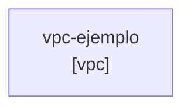

# Infrastructure Documentation: ejemplo-basico

**Description:** Ejemplo básico de VPC con CDK Templates
**Owner:** equipo-infraestructura
**Cost Center:** ingenieria

## Architecture Diagram

## Environments

### dev
- **Account ID:** 123456789012
- **Region:** us-east-1

## Resources

### vpc-ejemplo

**Type:** `vpc`

**Configuration:**

- **cidr:** `10.0.0.0/16`
- **availability_zones:** `2`
- **enable_dns_hostnames:** `True`
- **enable_dns_support:** `True`
- **enable_flow_logs:** `True`
- **nat_gateways:** `1`

**Tags:**

- Component: networking
- Purpose: ejemplo

